# Customer Segmentation & Churn Prediction




A focused project that segments customers, predicts churn, and lets you ask questions in plain English.

## Target Users
- Beginner Data Analysts,Scientists to use this repo to create/build their own churn prediction and retention **system** as per requirement from a static one.

## Dataset Used
- [**d0r1h/customer_churn**](https://huggingface.co/datasets/d0r1h/customer_churn)

## Prerequisites
- **Ollama** installed locally (to run local models if needed) [Optional]
- A **GEMINI API KEY** set in a `.env` variable `GEMINI_API_KEY` **[MUST]**
- Access to a free open cloud model such as **nemotron-3-super:cloud** (ensure it’s available in your model provider) [Optional]
- For installation Guide on ollama and free cloud model visit -> [Steps](https://www.google.com/search?q=How+to+install+ollama+and+run+nemotron-3-super%3Acloud+model+in+it+explain+step+by+step%3F&oq=How+to+install+ollama+and+run+nemotron-3-super%3Acloud+model+in+it+explain+step+by+step%3F&gs_lcrp=EgZjaHJvbWUyBggAEEUYOdIBCDE2NjFqMGo3qAIAsAIA&sourceid=chrome&source=chrome.ob&ie=UTF-8)
- Guide to create API Key visit -> [Steps](https://www.google.com/search?q=How+to+create+gemini+api+key+give+accurate+correct+step+by+step+instructions&sca_esv=c4b1addd543662be&sxsrf=APpeQnsLjtUybnfMaLdXsYo8A5jIXVfvPA%3A1786779998935&ei=XhmAavzOONO3hvcP1P672Ao&biw=1920&bih=1017&ved=0ahUKEwj89YKZkqKWAxXTm-EIHVT_DqsQ4dUDCBE&uact=5&oq=How+to+create+gemini+api+key+give+accurate+correct+step+by+step+instructions&gs_lp=Egxnd3Mtd2l6LXNlcnAiTEhvdyB0byBjcmVhdGUgZ2VtaW5pIGFwaSBrZXkgZ2l2ZSBhY2N1cmF0ZSBjb3JyZWN0IHN0ZXAgYnkgc3RlcCBpbnN0cnVjdGlvbnMyChAAGEcY1gQYsAMyChAAGEcY1gQYsAMyChAAGEcY1gQYsAMyChAAGEcY1gQYsAMyChAAGEcY1gQYsAMyChAAGEcY1gQYsAMyChAAGEcY1gQYsAMyChAAGEcY1gQYsAMyDhAAGOQCGNYEGLAD2AEBMg4QABjkAhjWBBiwA9gBATIOEAAY5AIY1gQYsAPYAQEyFxAuGNwGGLgGGNoGGNgCGMgDGLAD2AEBMhcQLhjcBhi4BhjaBhjYAhjIAxiwA9gBATIXEC4Y3AYYuAYY2gYY2AIYyAMYsAPYAQEyFxAuGNwGGLgGGNoGGNgCGMgDGLAD2AEBSOUsUNQJWJUmcAF4AZABAJgBjwGgAZIGqgEDMC42uAEDyAEA-AEBmAIGoAKfBcICBxAjGLACGCeYAwDiAwUSATEgQIgGAZAGD7oGBggBEAEYCZIHAzEuNaAHkCqyBwMwLjW4B5cFwgcFMC4zLjPIBxKACAE&sclient=gws-wiz-serp)
- Run :
   ```
   ollama launch claude
   ```
## What it does
- **Cleans & engineers features** from raw data (RFM, login, transaction stats).
- **Trains a churn prediction model** (RandomForest pipeline) saved as `models/churn_prediction_pipeline.pkl`.
- **Analyzes segments**: gives cluster‑level churn rates and the top features that drive churn in each segment.
- **Powers a Gemini agent** that answers:
  - *About segments*: “What are the traits of high‑risk clusters?”
  - *About a new customer*: “What’s the churn chance for a 35‑year‑old who logged in 2 days ago?”

## Key features
- End‑to‑end pipeline: data → model → insights -> report
- Used machine learning algorithms 
- **Random Forest** for Churn Prediction 
- **K Means Clustering** for Retention and segmentation of customers
- Simple, dependency‑light setup (see `requirements.txt`).
- Provide robust analysis and precise overview with prediction features
- [Visual Mind Maps for easy understanding of the flow of execution](https://github.com/FixerSoup/Churn-Prediction-Retention-Analysis/tree/main/visual%20mindmaps%20for%20easy%20understanding)

## Basic terms (short & precise)
- **Churn**: Customer leaves or stops using the service.
- **Segmentation**: Grouping customers with similar behavior.
- **Feature**: Measurable input for the model (e.g., age, days since last login).
- **Model**: Algorithm that learns patterns to predict churn.
- **Probability**: Estimated chance of churn (0 = never, 1 = certain).

## Claude Code Subscription Note
- If you already have a Claude Code subscription, you can use the agent directly without additional setup.  
- If you do not have a subscription and want to use the agent for free, follow the prerequisites and steps above.

## How to run via **powershell**
1. Clone Repo
   ```
   git clone https://github.com/FixerSoup/Churn-Prediction-Retention-Analysis.git
   ```
2. Move to project Root Folder
   ```
   cd Churn-Prediction-Retention-Analysis
   ```
3. Create a `.env` file with your own Gemini key
   ```
   Set-Content -Path .env -Value 'GEMINI_API_KEY=paste_your_actual_key_here' -NoNewline -Encoding ascii
   ```
4. Create virtual env
   ```
   python -m venv your_env_name
   ```
   **Note** if using conda env then : 
   ```
   conda create -n your_env_name python=3.14
   conda activate your_env_name
   ```
5. Activate venv
   ```
   .\venv\Scripts\Activate.ps1
   ```  
6. Install dependencies  
   ```bash
   pip install -r requirements.txt
   ```
7. Launch the agent (or demo)  
   ```bash
   python scripts/run_agent.py
   ```
8. To save the report as a pdf file
```
python scripts/save_to_pdf.py
```
## Some Examples for Prompts
```
1. Churn Rate Overview: "Calculate the overall churn rate and show monthly churn trends over the past 6 months. Include a simple line chart visualization."
2. Customer Segmentation: "Segment customers into 3 groups based on their usage frequency and monthly spending. Describe each segment's characteristics and churn risk level."
3. Retention Cohort Analysis: "Perform cohort analysis showing 30-day, 60-day, and 90-day retention rates for customers who signed up in the last 3 months."
4. Key Churn Drivers: "Identify the top 5 factors most strongly associated with churn using simple correlation analysis. Explain each factor in plain language."
5. At-Risk Customer Identification: "List 10 customers with the highest churn probability based on their recent behavior changes. Include their risk score and key warning signs."
6. Simple Retention Score: "Create a retention health score (0-100) for each customer based on login frequency, feature usage, and support tickets. Show distribution of scores across customer base."
```
## **Unique Feature of the project**
- use claude code via ollama to understand the project workflow easily
## Files you’ll see
- `data/raw_data/` – original CSV (untouched).
- `data/cleaned_data/` – cleaned, clustered data and feature importance.
- `models/` – trained model and Gemini‑generated reports.
- `scripts/` – training (`train_model.py`), agent (`tool_develop.py`), utilities.
- `notebooks/` – exploratory work (EDA, clustering, RFM).

## Claude Code Skills
The project includes custom Claude Code skills to streamline common tasks:

- **`/generate-churn-report`** – Produces a full churn analysis report (executive summary, segmentation, drivers, model performance, recommendations) and saves it as Markdown/PDF.
- **`customer-segmentation-retention`** – Provides end‑to‑end project guidance and best‑practice explanations for every stage of the workflow.
- **`train model`** – Helper skill that walks you through model training and evaluation.

You can use these skills to integrate these stuffs to your project with claude code in a structured manner.
```
python scripts/run_agent.py
```
That’s it—short, churn‑focused, and ready to use.

## License
- Do not copy paste and use this repo ❌
- Use it as a branch/feature extension for your own churn systems ✅

- A star is always appreciated if it helps you ⭐